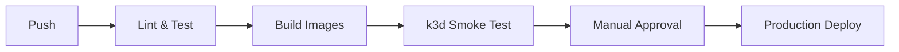

# Model Zoo - Ray ML Inference Platform

A production-ready platform for deploying cutting-edge ML models (CLIP, Grounding DINO + SAM2, Qwen 2.5 VL) using Ray on Kubernetes. Features horizontal scaling, Ray Client protocol access, and seamless cloud/local deployment.

## ✨ Features

- **🚀 One-GPU-per-Actor**: Horizontal scaling with Ray remote actors
- **🔗 Ray Client Only**: Direct gRPC access on port 10001 (no HTTP gateway)  
- **☁️ Multi-Cloud**: Deploy to GKE production or k3d local development
- **📈 Auto-Scaling**: HPA with `ray_actor_queue_size` metrics and scale-to-zero
- **🔐 Secure**: GCP Workload Identity, RBAC, LoadBalancer IP restrictions
- **🎯 Model Zoo**: CLIP, Grounding DINO + SAM2, Qwen 2.5 VL ready to deploy

## 🏃‍♂️ Quick Start

### Prerequisites

```bash
# Install CLI
pip install -e .

# For local development
brew install k3d kubectl  # macOS
# OR
curl -s https://raw.githubusercontent.com/k3d-io/k3d/main/install.sh | bash  # Linux

# For GKE production
gcloud auth login
kubectl config current-context  # Should point to your GKE cluster
```

### Local Development (k3d)

```bash
# 1. Start local cluster
./scripts/dev_cluster.sh

# 2. Deploy CLIP model
model-zoo deploy clip-vit-base \
  --weights gs://your-bucket/clip/weights \
  --gpu nvidia-tesla-t4 \
  --target k3d

# 3. Run inference
model-zoo infer clip-vit-base \
  --file image.jpg \
  --text "a photo of a cat"

# 4. View logs
model-zoo logs clip-vit-base --tail

# 5. List models
model-zoo list
```

### Production Deployment (GKE)

```bash
# 1. Set environment
export GCP_PROJECT_ID="your-project-id"

# 2. Deploy with autoscaling
model-zoo deploy qwen-vl-chat \
  --weights gs://your-bucket/qwen-vl/weights \
  --gpu nvidia-tesla-a100 \
  --target gke \
  --namespace production

# 3. Run visual question answering
model-zoo infer qwen-vl-chat \
  --file image.jpg \
  --question "What objects are in this image?" \
  --namespace production
```

## 🎯 Supported Models

| Model | Type | Input | Output | Example |
|-------|------|-------|--------|---------|
| **CLIP** | Image-Text Similarity | `image + text` | `{similarity: float}` | `--text "a red car"` |
| **Grounding DINO + SAM2** | Object Detection + Segmentation | `image + text_prompt` | `{mask_png_b64: str}` | `--text-prompt "person"` |
| **Qwen 2.5 VL** | Visual Question Answering | `image + question` | `{answer: str}` | `--question "What's in the image?"` |

## 🔧 Adding a New Model (5 Steps)

### 1. Create Actor Class

```python
# model_zoo/actors/my_model.py
from model_zoo.actors.base import HFModelActor

class MyModelActor(HFModelActor):
    async def _load_model(self):
        # Load your model from self.weights_uri
        self.model = load_my_model(self.weights_uri)
    
    async def infer(self, payload):
        # Implement inference
        result = self.model(payload["input"])
        return {"output": result}
```

### 2. Register in Factory

```python
# model_zoo/actors/factory.py - add to make() function
elif "my_model" in model_name:
    from model_zoo.actors.my_model import MyModelActor
    return MyModelActor
```

### 3. Add CLI Support

```python
# model_zoo/cli.py - add to infer() function
elif "my_model" in model_name:
    if not input_param:
        console.print("[red]--input required for My Model[/red]")
        raise typer.Exit(1)
    payload = {"input": input_param}
```

### 4. Create Tests

```python
# tests/perf/test_my_model.py
@pytest.mark.asyncio
async def test_my_model_performance():
    actor = MyModelActor.remote("my-model", "gs://fake/weights")
    assert await actor.ready.remote()
    
    result = await actor.infer.remote({"input": "test"})
    assert "output" in result
```

### 5. Deploy

```bash
model-zoo deploy my-model \
  --weights gs://bucket/my-model/weights \
  --gpu nvidia-tesla-t4 \
  --target k3d
```

## 🏗️ Architecture

```
┌─────────────────┐    ┌──────────────────┐    ┌─────────────────┐
│   CLI Client    │───▶│  LoadBalancer    │───▶│   Ray Head      │
│  model-zoo CLI  │    │   (port 10001)   │    │  + Driver Pod   │
└─────────────────┘    └──────────────────┘    └─────────────────┘
                                                         │
                       ┌─────────────────────────────────┼─────────────────┐
                       ▼                                 ▼                 ▼
                ┌─────────────┐                   ┌─────────────┐   ┌─────────────┐
                │ Ray Worker  │                   │ Ray Worker  │   │ Ray Worker  │
                │  + 1 GPU    │                   │  + 1 GPU    │   │  + 1 GPU    │
                │  + Actor    │                   │  + Actor    │   │  + Actor    │
                └─────────────┘                   └─────────────┘   └─────────────┘
```

### Key Design Decisions

- **Ray Client Protocol**: Direct gRPC access, no HTTP gateway
- **One GPU per Actor**: Predictable resource allocation, horizontal scaling  
- **Cluster per Model**: Isolated deployments with independent scaling
- **GCS Weights**: Hierarchical storage `gs://bucket/project/model/variant/sha/`
- **External Metrics**: HPA scales on `ray_actor_queue_size ≤ 1`

## 📊 Monitoring

### Grafana Dashboard

Import `observability/grafana_model_zoo.json` for comprehensive monitoring:

- Ray actor queue sizes and scaling events
- GPU utilization and inference latency (P50/P95)  
- Request rates and error rates by model
- Pod health and HPA status

### Key Metrics

```promql
# Ray actor queue size (primary scaling metric)
ray_actor_queue_size{model_name="clip-vit-base"}

# Inference latency percentiles  
histogram_quantile(0.95, rate(ray_serve_request_latency_ms_bucket[5m]))

# GPU utilization
nvidia_gpu_utilization

# Pod scaling events
kube_hpa_status_current_replicas
```

## 🔒 Security

- **Workload Identity**: No secrets in repository, automatic GCP access
- **RBAC**: Least-privilege service accounts per model
- **Network Security**: LoadBalancer restricted to VPN CIDR ranges
- **Image Security**: Automated CVE scanning in CI/CD pipeline

## 🚀 CI/CD Pipeline



- **Matrix Builds**: Ubuntu/macOS across Python versions
- **Docker Caching**: BuildKit with GitHub Actions cache
- **Smoke Tests**: Real k3d deployment with Ray connectivity
- **Manual Gates**: Production environment approval required
- **Roll-forward Only**: No rollbacks, canary testing with auto-cleanup

## 📚 Documentation

- **[Production Runbook](docs/production_runbook.md)**: Operational procedures, troubleshooting
- **[CLI Examples](examples/cli_usage.sh)**: Common deployment patterns
- **Phase Verification**: `scripts/verify_phase_*.sh` for acceptance testing

## 🧪 Testing

```bash
# Unit tests
pytest tests/unit -v

# Performance tests (CPU)
pytest tests/perf -v

# End-to-end tests (requires k3d)
pytest tests/e2e -v

# All verification scripts
for script in scripts/verify_phase_*.sh; do ./"$script"; done
```

## 🎛️ Configuration

### Environment Variables

```bash
# Required for GKE
export GCP_PROJECT_ID="your-project-id"

# Optional
export RAY_ADDRESS="ray://localhost:10001"  # For local Ray development
```

### Model Storage Layout

```
gs://your-bucket/
├── project-name/
│   ├── clip/
│   │   ├── vit-base/
│   │   │   └── sha256hash/
│   │   │       ├── model.safetensors
│   │   │       └── config.json
│   │   └── vit-large/
│   ├── grounding-sam2/
│   └── qwen-vl/
```

## 🤝 Contributing

1. **Fork** the repository
2. **Create** a feature branch: `git checkout -b feature/new-model`  
3. **Add** your model following the 5-step guide above
4. **Test** with `pytest` and `scripts/verify_phase_*.sh`
5. **Submit** a pull request

### Development Setup

```bash
git clone https://github.com/your-org/model-zoo.git
cd model-zoo
pip install -e .[dev]
./scripts/dev_cluster.sh  # Start local k3d cluster
```

## 📋 Requirements

### System Requirements

- **Local**: macOS/Linux, Docker, k3d, 8GB+ RAM, 4+ CPU cores
- **Production**: GKE cluster with GPU nodes, GCS bucket access
- **GPU**: NVIDIA T4/A100/L4 (some 80GB for large models)

### Dependencies

- **Python**: 3.11+ 
- **Ray**: 2.9.0+ with default components
- **Kubernetes**: 1.24+ (GKE Standard or Autopilot)
- **Storage**: GCS with hierarchical model layout

## 📜 License

AGPL-3.0 - See [LICENSE](LICENSE) for details.

## 🙋‍♀️ Support

- **Issues**: [GitHub Issues](https://github.com/your-org/model-zoo/issues)
- **Discussions**: [GitHub Discussions](https://github.com/your-org/model-zoo/discussions)  
- **Documentation**: [Wiki](https://github.com/your-org/model-zoo/wiki)

---

**Version**: 0.1.0 | **Ray Inference Menagerie** 🐾