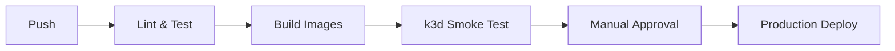

# Model Zoo - Ray ML Inference Platform

A production-ready platform for deploying cutting-edge ML models (CLIP, Grounding DINO + SAM2, Qwen 2.5 VL) using Ray on Kubernetes. Features horizontal scaling, Ray Client protocol access, and seamless cloud/local deployment.

## ✨ Features

- **🚀 One-GPU-per-Actor**: Horizontal scaling with Ray remote actors
- **🔗 Ray Client Only**: Direct gRPC access on port 10001 (no HTTP gateway)  
- **☁️ Multi-Cloud**: Deploy to GKE production or k3d local development
- **📈 Auto-Scaling**: HPA with `ray_actor_queue_size` metrics and scale-to-zero
- **🔐 Secure**: GCP Workload Identity, RBAC, LoadBalancer IP restrictions
- **🎯 Model Zoo**: CLIP, Grounding DINO + SAM2, Qwen 2.5 VL ready to deploy

## 🏃‍♂️ Quick Start

### Prerequisites

**System Requirements:**
- Python 3.10 or higher
- Docker Desktop or Docker Engine
- 8GB+ RAM recommended

```bash
# Check Python version
python --version  # Should be 3.10+

# Install CLI (will automatically install Ray, Typer, Rich, etc.)
pip install -e .

# For local development
brew install k3d kubectl  # macOS
# OR
curl -s https://raw.githubusercontent.com/k3d-io/k3d/main/install.sh | bash  # Linux

# For GKE production
gcloud auth login
kubectl config current-context  # Should point to your GKE cluster
```

### Local Development (k3d)

#### Step 1: Install Prerequisites

```bash
# Install k3d
# macOS
brew install k3d kubectl

# Linux
curl -s https://raw.githubusercontent.com/k3d-io/k3d/main/install.sh | bash

# Verify installation
k3d --version
kubectl version --client
```

#### Step 2: Install Model Zoo CLI

```bash
# Clone the repository
git clone https://github.com/lsb/ray-inference-menagerie-claude.git
cd ray-inference-menagerie-claude

# Install in development mode (automatically installs all dependencies:
# Ray, Typer, Rich, Kubernetes, PyTorch, Transformers, etc.)
pip install -e .

# Verify CLI installation
model-zoo --help

# Or run verification script
./scripts/verify_install.sh
```

**Troubleshooting Installation:**

If you get a Python version error:

```bash
# Check your Python version
python --version

# If you have Python 3.10+ but pip install fails, try:
python3.10 -m pip install -e .
# or
python3.11 -m pip install -e .
```

If `pip install -e .` fails completely:

```bash
# Alternative 1: Use PYTHONPATH method
pip install ray[default] typer rich kubernetes pillow
export PYTHONPATH="${PYTHONPATH}:$(pwd)"
python -m model_zoo.cli --help
```

If you get dependency conflicts:

```bash
# Alternative 2: Minimal install for basic testing
pip install ray[default] typer rich pillow
python -m model_zoo.cli --help
```

#### Step 3: Start Local Cluster

```bash
# Start k3d cluster with fake GPU support
./scripts/dev_cluster.sh

# Verify cluster
kubectl get nodes
```

#### Step 4: Build and Deploy Test Model

```bash
# Build Docker image locally
docker build -t model-zoo-clip-test:latest -f infra/docker/Dockerfile.model .

# Import image into k3d
k3d image import model-zoo-clip-test:latest -c model-zoo-dev

# Deploy CLIP model (uses CPU in local mode)
model-zoo deploy clip-test \
  --weights gs://fake-bucket/clip/weights \
  --gpu nvidia-tesla-t4 \
  --target k3d

# If using alternative method:
# python -m model_zoo.cli deploy clip-test --weights gs://fake-bucket/clip/weights --gpu nvidia-tesla-t4 --target k3d
```

#### Step 5: Create Test Image

```bash
# Create a test image for inference
python scripts/create_test_image.py --type simple

# This creates test_images/test_image.jpg - a red square with white center
# You can also create other test images:
# python scripts/create_test_image.py --type all  # Creates multiple test images

# Or use the included Stable Diffusion XL generated test images:
ls test_images/fixtures/
# cat_office_typing.jpg    - Cat typing in office (indoor cat scene)
# dog_office_typing.jpg    - Dog typing in office (indoor dog scene)  
# cat_mountain_sunrise.jpg - Cat on mountain at sunrise (outdoor cat scene)
# dog_mountain_sunrise.jpg - Dog on mountain at sunrise (outdoor dog scene)
```

#### Step 6: Run Inference

```bash
# Check deployment status
model-zoo list
# Alternative: python -m model_zoo.cli list

# Run CLIP inference (test cat vs dog classification)
model-zoo infer clip-test \
  --file test_images/fixtures/cat_office_typing.jpg \
  --text "a cat typing at a computer"

# Test with different prompts to see model accuracy:
# model-zoo infer clip-test --file test_images/fixtures/cat_office_typing.jpg --text "a dog"
# model-zoo infer clip-test --file test_images/fixtures/dog_mountain_sunrise.jpg --text "a dog on a mountain"

# View logs
model-zoo logs clip-test --tail
# Alternative: python -m model_zoo.cli logs clip-test --tail
```

#### Step 7: Clean Up

```bash
# Delete the model
model-zoo delete clip-test --yes
# Alternative: python -m model_zoo.cli delete clip-test --yes

# Stop k3d cluster (optional)
k3d cluster delete model-zoo-dev
```

#### Troubleshooting Local Deployment

If you encounter issues:

```bash
# Check pod status
kubectl get pods -A

# View detailed logs
kubectl logs -l app=model-zoo

# Check services
kubectl get svc

# Verify image imports
docker exec k3d-model-zoo-dev-agent-0 crictl images

# Manual port-forward for debugging
kubectl port-forward svc/clip-test-ray-head 10001:10001 8265:8265

# Test Ray connection directly
python -c "
import ray
ray.init('ray://localhost:10001')
print('✓ Connected to Ray')
ray.shutdown()
"
```

**Note**: Local k3d deployment uses fake GPU labels and runs on CPU for testing purposes.

#### Alternative: Manual Testing with Basic Ray

If the CLI deployment has issues, you can test with basic Ray:

```bash
# 1. Create simple Ray deployment
cat > test-ray.yaml << 'EOF'
apiVersion: apps/v1
kind: Deployment
metadata:
  name: test-ray-head
spec:
  replicas: 1
  selector:
    matchLabels:
      app: test-ray
  template:
    metadata:
      labels:
        app: test-ray
    spec:
      containers:
      - name: ray-head
        image: rayproject/ray:2.9.0
        command: ["ray", "start", "--head", "--port=6379", "--dashboard-host=0.0.0.0"]
        ports:
        - containerPort: 10001
        - containerPort: 8265
---
apiVersion: v1
kind: Service
metadata:
  name: test-ray-head
spec:
  selector:
    app: test-ray
  ports:
  - name: client
    port: 10001
  - name: dashboard
    port: 8265
EOF

# 2. Deploy and test
kubectl apply -f test-ray.yaml
kubectl wait --for=condition=ready pod -l app=test-ray --timeout=300s
kubectl port-forward svc/test-ray-head 10001:10001 8265:8265 &

# 3. Test connection
python -c "
import ray
ray.init('ray://localhost:10001')
print('✓ Ray connection successful!')
print('Dashboard: http://localhost:8265')
ray.shutdown()
"

# 4. Clean up
kubectl delete -f test-ray.yaml
kill %1  # Stop port-forward
```

### Production Deployment (GKE)

```bash
# 1. Set environment
export GCP_PROJECT_ID="your-project-id"

# 2. Deploy with autoscaling
model-zoo deploy qwen-vl-chat \
  --weights gs://your-bucket/qwen-vl/weights \
  --gpu nvidia-tesla-a100 \
  --target gke \
  --namespace production

# 3. Run visual question answering
model-zoo infer qwen-vl-chat \
  --file image.jpg \
  --question "What objects are in this image?" \
  --namespace production
```

## 🎯 Supported Models

| Model | Type | Input | Output | Example |
|-------|------|-------|--------|---------|
| **CLIP** | Image-Text Similarity | `image + text` | `{similarity: float}` | `--text "a red car"` |
| **Grounding DINO + SAM2** | Object Detection + Segmentation | `image + text_prompt` | `{mask_png_b64: str}` | `--text-prompt "person"` |
| **Qwen 2.5 VL** | Visual Question Answering | `image + question` | `{answer: str}` | `--question "What's in the image?"` |

## 🔧 Adding a New Model (5 Steps)

### 1. Create Actor Class

```python
# model_zoo/actors/my_model.py
from model_zoo.actors.base import HFModelActor

class MyModelActor(HFModelActor):
    async def _load_model(self):
        # Load your model from self.weights_uri
        self.model = load_my_model(self.weights_uri)
    
    async def infer(self, payload):
        # Implement inference
        result = self.model(payload["input"])
        return {"output": result}
```

### 2. Register in Factory

```python
# model_zoo/actors/factory.py - add to make() function
elif "my_model" in model_name:
    from model_zoo.actors.my_model import MyModelActor
    return MyModelActor
```

### 3. Add CLI Support

```python
# model_zoo/cli.py - add to infer() function
elif "my_model" in model_name:
    if not input_param:
        console.print("[red]--input required for My Model[/red]")
        raise typer.Exit(1)
    payload = {"input": input_param}
```

### 4. Create Tests

```python
# tests/perf/test_my_model.py
@pytest.mark.asyncio
async def test_my_model_performance():
    actor = MyModelActor.remote("my-model", "gs://fake/weights")
    assert await actor.ready.remote()
    
    result = await actor.infer.remote({"input": "test"})
    assert "output" in result
```

### 5. Deploy

```bash
model-zoo deploy my-model \
  --weights gs://bucket/my-model/weights \
  --gpu nvidia-tesla-t4 \
  --target k3d
```

## 🏗️ Architecture

```
┌─────────────────┐    ┌──────────────────┐    ┌─────────────────┐
│   CLI Client    │───▶│  LoadBalancer    │───▶│   Ray Head      │
│  model-zoo CLI  │    │   (port 10001)   │    │  + Driver Pod   │
└─────────────────┘    └──────────────────┘    └─────────────────┘
                                                         │
                       ┌─────────────────────────────────┼─────────────────┐
                       ▼                                 ▼                 ▼
                ┌─────────────┐                   ┌─────────────┐   ┌─────────────┐
                │ Ray Worker  │                   │ Ray Worker  │   │ Ray Worker  │
                │  + 1 GPU    │                   │  + 1 GPU    │   │  + 1 GPU    │
                │  + Actor    │                   │  + Actor    │   │  + Actor    │
                └─────────────┘                   └─────────────┘   └─────────────┘
```

### Key Design Decisions

- **Ray Client Protocol**: Direct gRPC access, no HTTP gateway
- **One GPU per Actor**: Predictable resource allocation, horizontal scaling  
- **Cluster per Model**: Isolated deployments with independent scaling
- **GCS Weights**: Hierarchical storage `gs://bucket/project/model/variant/sha/`
- **External Metrics**: HPA scales on `ray_actor_queue_size ≤ 1`

## 📊 Monitoring

### Grafana Dashboard

Import `observability/grafana_model_zoo.json` for comprehensive monitoring:

- Ray actor queue sizes and scaling events
- GPU utilization and inference latency (P50/P95)  
- Request rates and error rates by model
- Pod health and HPA status

### Key Metrics

```promql
# Ray actor queue size (primary scaling metric)
ray_actor_queue_size{model_name="clip-vit-base"}

# Inference latency percentiles  
histogram_quantile(0.95, rate(ray_serve_request_latency_ms_bucket[5m]))

# GPU utilization
nvidia_gpu_utilization

# Pod scaling events
kube_hpa_status_current_replicas
```

## 🔒 Security

- **Workload Identity**: No secrets in repository, automatic GCP access
- **RBAC**: Least-privilege service accounts per model
- **Network Security**: LoadBalancer restricted to VPN CIDR ranges
- **Image Security**: Automated CVE scanning in CI/CD pipeline

## 🚀 CI/CD Pipeline



- **Matrix Builds**: Ubuntu/macOS across Python versions
- **Docker Caching**: BuildKit with GitHub Actions cache
- **Smoke Tests**: Real k3d deployment with Ray connectivity
- **Manual Gates**: Production environment approval required
- **Roll-forward Only**: No rollbacks, canary testing with auto-cleanup

## 📚 Documentation

- **[Production Runbook](docs/production_runbook.md)**: Operational procedures, troubleshooting
- **[CLI Examples](examples/cli_usage.sh)**: Common deployment patterns
- **Phase Verification**: `scripts/verify_phase_*.sh` for acceptance testing

## 🧪 Testing

```bash
# Unit tests
pytest tests/unit -v

# Performance tests (CPU)
pytest tests/perf -v

# Model validation tests with Stable Diffusion images
pytest tests/perf/test_model_validation.py -v -s

# End-to-end tests (requires k3d)
pytest tests/e2e -v

# All verification scripts
for script in scripts/verify_phase_*.sh; do ./"$script"; done
```

## 🎛️ Configuration

### Environment Variables

```bash
# Required for GKE
export GCP_PROJECT_ID="your-project-id"

# Optional
export RAY_ADDRESS="ray://localhost:10001"  # For local Ray development
```

### Model Storage Layout

```
gs://your-bucket/
├── project-name/
│   ├── clip/
│   │   ├── vit-base/
│   │   │   └── sha256hash/
│   │   │       ├── model.safetensors
│   │   │       └── config.json
│   │   └── vit-large/
│   ├── grounding-sam2/
│   └── qwen-vl/
```

## 🤝 Contributing

1. **Fork** the repository
2. **Create** a feature branch: `git checkout -b feature/new-model`  
3. **Add** your model following the 5-step guide above
4. **Test** with `pytest` and `scripts/verify_phase_*.sh`
5. **Submit** a pull request

### Development Setup

```bash
git clone https://github.com/lsb/ray-inference-menagerie-claude.git
cd ray-inference-menagerie-claude

# Install with development dependencies (pytest, ruff, etc.)
pip install -e .[dev]

# Start local k3d cluster
./scripts/dev_cluster.sh

# Run tests
pytest tests/unit -v
```

## 📋 Requirements

### System Requirements

- **Local**: macOS/Linux, Docker, k3d, 8GB+ RAM, 4+ CPU cores
- **Production**: GKE cluster with GPU nodes, GCS bucket access
- **GPU**: NVIDIA T4/A100/L4 (some 80GB for large models)

### Dependencies

- **Python**: 3.10+ 
- **Ray**: 2.9.0+ with default components
- **Kubernetes**: 1.24+ (GKE Standard or Autopilot)
- **Storage**: GCS with hierarchical model layout

## 📜 License

AGPL-3.0 - See [LICENSE](LICENSE) for details.

## 🙋‍♀️ Support

- **Issues**: [GitHub Issues](https://github.com/your-org/model-zoo/issues)
- **Discussions**: [GitHub Discussions](https://github.com/your-org/model-zoo/discussions)  
- **Documentation**: [Wiki](https://github.com/your-org/model-zoo/wiki)

---

**Version**: 0.1.0 | **Ray Inference Menagerie** 🐾